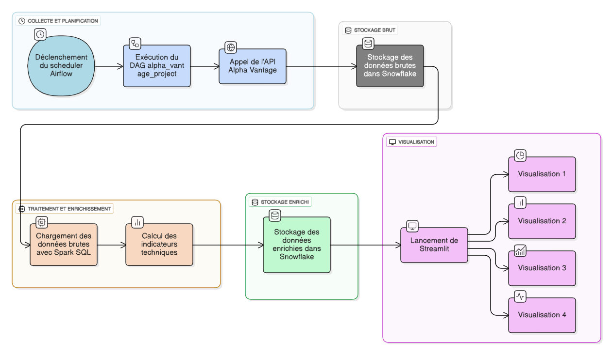

# 📈 Alpha Vantage Financial Data Pipeline

## 📋 Vue d'ensemble

Ce projet implémente un pipeline Big Data financier complet pour la collecte, le traitement, l'enrichissement et la visualisation de données boursières à partir de l'API Alpha Vantage.

Le pipeline est :
- **Orchestré** par Apache Airflow  
- **Stocké** dans Snowflake  
- **Traité** avec Spark SQL  
- **Visualisé** via Streamlit  
- **Déployé** avec Docker  

---

## 📊 Table des matières

- [Architecture](#-architecture-globale)
- [Étapes d'installation](#-étapes-dinstallation)
- [Configuration](#-configuration)
- [Utilisation](#-utilisation)
- [Visualisations](#-visualisations)
- [Structure du projet](#-structure-du-projet)
- [Technologies](#-technologies)

---

## 🏗️ Architecture globale



**Flux de données :**
```
Collecte → Airflow DAG → API Alpha Vantage → Snowflake (brut) 
→ Spark SQL → Indicateurs techniques → Snowflake (enrichi) → Streamlit Dashboard
```

---

## 📝 Étapes d'installation

### 1. Prérequis

- Python 3.11+
- Docker
- Compte Snowflake
- Clé API Alpha Vantage

### 2. Cloner le projet
```bash
git clone https://github.com/elmahjoubisouka/Alpha-vantage-pipeline.git
cd airflow-finance-project
```

### 3. Installer les dépendances
```bash
pip install -r requirements.txt
```

### 4. Configuration Snowflake

Exécuter dans Snowflake :
```sql
USE DATABASE FINANCE_DB;
USE SCHEMA RAM_DATA;

CREATE OR REPLACE TABLE ALPHA_VANTAGE_DATA (
    symbol VARCHAR(10) NOT NULL,
    date DATE NOT NULL,
    open DECIMAL(10, 4),
    high DECIMAL(10, 4),
    low DECIMAL(10, 4),
    close DECIMAL(10, 4),
    volume BIGINT,
    dividends DECIMAL(10, 4),
    stock_splits DECIMAL(10, 4),
    batch_id VARCHAR(50),
    data_source VARCHAR(50),
    api_key_used VARCHAR(20),
    load_timestamp TIMESTAMP DEFAULT CURRENT_TIMESTAMP(),
    CONSTRAINT pk_alpha_vantage PRIMARY KEY (symbol, date, batch_id)
);
```

### 5. Variables d'environnement (.env)

Créer un fichier `.env` à la racine du projet :
```bash
ALPHA_VANTAGE_API_KEY=votre_cle
SNOWFLAKE_ACCOUNT=votre_compte
SNOWFLAKE_USER=votre_user
SNOWFLAKE_PASSWORD=votre_mdp
SNOWFLAKE_DATABASE=FINANCE_DB
SNOWFLAKE_SCHEMA=RAM_DATA
```

### 6. Installer le connecteur Spark-Snowflake
```bash
mkdir -p /opt/airflow/spark_jars
curl -L -o /opt/airflow/spark_jars/spark-snowflake_2.12-2.11.0-spark_3.3.jar \
https://repo1.maven.org/maven2/net/snowflake/spark-snowflake_2.12/2.11.0-spark_3.3/spark-snowflake_2.12-2.11.0-spark_3.3.jar
```

### 7. Lancer avec Docker
```bash
docker-compose up -d
docker-compose ps
```

---

## 🚀 Utilisation

### 1. Démarrer Airflow

- Accéder à l'interface web : [http://localhost:8081](http://localhost:8081)
- Activer le DAG `alpha_vantage_project`

### 2. Lancer Streamlit
```bash
python -m streamlit run streamlit_dashboard.py
```

- Accéder au dashboard : [http://localhost:8501](http://localhost:8501)

---

## 📊 Visualisations

Le dashboard Streamlit offre :

- **Signaux de trading** (RSI, MACD)
- **Performance par période**
- **Matrice de corrélations**
- **Données brutes et enrichies**

---

## 📁 Structure du projet
```
airflow-finance-project/
├── dags/
│   └── alpha_vantage_project.py
├── processors/
│   └── spark_processor.py
├── scripts/
│   └── data_collection.py
├── streamlit_dashboard.py
├── docker-compose.yml
├── requirements.txt
└── README.md
```

---

## 🔧 Technologies

- **Apache Airflow** 2.8.0
- **Snowflake** (Data Warehouse)
- **Spark SQL** 3.3
- **Streamlit** 1.52.1
- **Alpha Vantage API**
- **Docker**
- **Python** 3.11


## 📧 Contact

Pour toute question ou suggestion, n'hésitez pas à ouvrir une issue sur GitHub.
